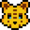
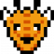
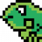

<h1 align="center">FCC Cohorts Favicon Implementation Instruction</h1>
<h2 align="center">A wild Koala appeared!</h2>

How to add these beautiful animals to your webpage 
<a href="./animals">Animals</a> 

 

 

 

 

<a href="./robots">Robots</a> 

 

<a href="./misc">Badges</a> 

<a href="./misc">Misc</a> 

<ul>
<li>Download the <i>favicon folder of your spirit animal</i> provided in this repo and add it to your root project folder(where you have index.html) changing the name to just <i>favicon</i></li>
<li>Add the code provided in code.html inside your <i>index.html &lt;head&gt; tag;</i></li>
<li>Place favicon.ico(it is inside the favicon folder) in the same folder as index.html</li>
<li>Commit, push whatever you want, you now have all the favicons for every device and browser that will ever exist!</li>
</ul>

<h4>FAQ</h4>

<b>Why is there no code for favicon.ico?</b> 
The favicon.ico file is grabbed by the browser automatically, you don't need to write code for it. 

<b>Why all these favicons?</b> 
There are an awful lot of different devices and browsers with the weirdest ideas about favicons, we just satisfy everyone, you can check how your good are your favicons on <a href="http://www.favicomatic.com/favicon-test">this website</a>. 

<b>I did everything you said but I can't see my beautiful new favicon!</b> 
Go to your website adress and add <code>/favicon.ico</code> at the end of it, load the page, close the browser, open it back again. 
If this doesn't work clear your browser cache.

<h4>History</h4>

14/04/2017 Added new folder for badges! The SpeedRunner badge for Chingu is just the beginning! 
12/03/2017 As the ice melts, new animals as Koala, Flamingo, Giraffe, Wombat and Iguana come to populate the repo! 
17/02/2017 Winter is coming and it brings Penguin, Moose, Beluga, Turtle and Lion(yes a lion!). 
13/01/2017 The mistic Alpaca and Meerkat reach the repo from a distant land. 
17/12/2016 The Pearboar summoning is complete. 
12/12//2016 Added robots for cheetah's new project(link soon). 
09/12/2016 Added Cheetah, Rhino, Racoon, Kangaroo and Artic Fox. 
01/12/2016 Created Red Panda.

<i>Made for the Red Pandas FreeCodeCamp cohort</i>

